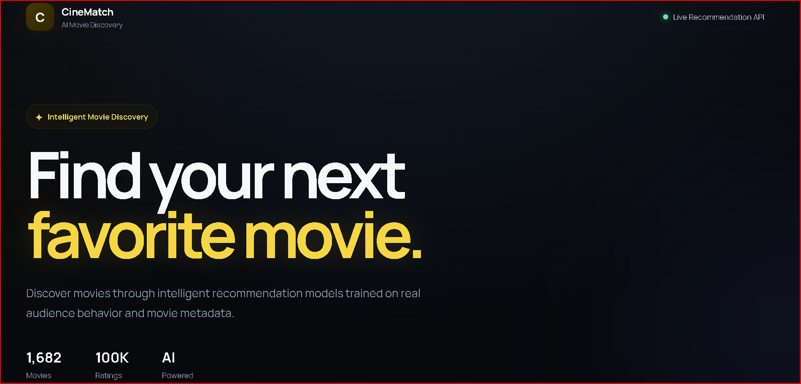
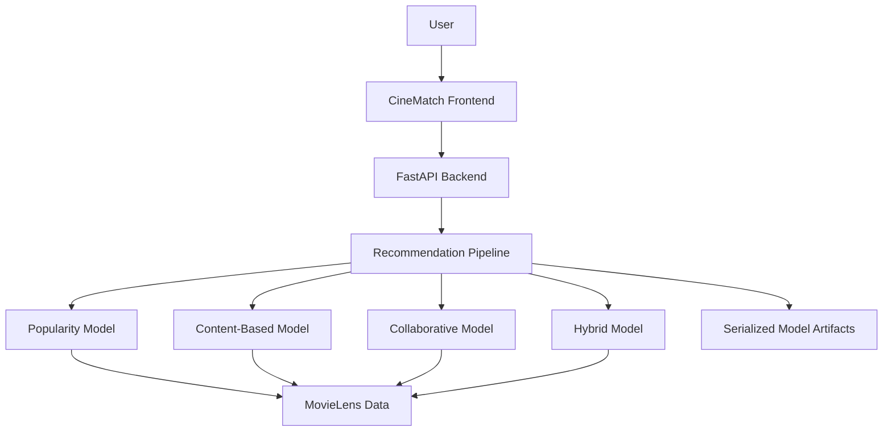
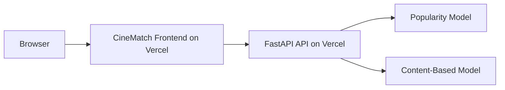

# CineMatch AI — Movie Recommendation Engine

[](https://github.com/AnalyticPalmer/movie-recommendation-engine/actions/workflows/tests.yml)


CineMatch AI is a production-oriented movie recommendation system built with Python, machine learning, FastAPI, and a responsive web interface.

The project uses the MovieLens 100K dataset and implements multiple recommendation strategies, model evaluation, automated testing, continuous integration, API deployment, and a live frontend.

## Preview



## Live Demo

Frontend:

https://cinematch-ai-henna.vercel.app

Backend API:

https://movie-recommendation-engine-nu.vercel.app

Health Check:

https://movie-recommendation-engine-nu.vercel.app/api/health

FastAPI Documentation:

https://movie-recommendation-engine-nu.vercel.app/docs

## Key Features

- Popularity-based movie recommendations
- Content-based movie similarity
- Collaborative filtering using Alternating Least Squares
- Hybrid recommendation model
- Temporal leave-one-out data splitting
- Recommender-system evaluation
- FastAPI prediction service
- Responsive CineMatch AI frontend
- Automated API testing with Pytest
- GitHub Actions continuous integration
- Vercel deployment
- Reusable model and prediction pipelines

## How It Works

A user interacts with the CineMatch frontend and requests either popular movies or movies similar to a selected MovieLens movie.

The frontend sends the request to the deployed FastAPI backend.

FastAPI passes the request to the recommendation pipeline, which loads the appropriate trained model and returns movie recommendations.

The results are converted to JSON and displayed by the frontend.

## Architecture



### Production Deployment



The collaborative and hybrid models are implemented and evaluated locally but are not currently exposed through the Vercel production API because the `implicit` library depends on native OpenMP libraries that are unavailable in the standard Vercel Python runtime.

## Recommendation Models

### Popularity-Based Recommender

Ranks movies using a weighted scoring method that considers both:

- Average movie rating
- Number of ratings received

This reduces the chance that movies with very few ratings appear artificially high in the ranking.

### Content-Based Recommender

Uses movie genre metadata.

The pipeline applies:

- TF-IDF feature extraction
- Cosine similarity

Example recommendations for `Star Wars (1977)` include:

- Return of the Jedi
- The Empire Strikes Back
- Starship Troopers
- Independence Day

### Collaborative Filtering

Uses Alternating Least Squares to learn latent user and movie representations from user-item interactions.

Configuration:

- Factors: 50
- Regularization: 0.01
- Iterations: 20
- Random state: 42

### Hybrid Recommender

Combines collaborative filtering and content-based recommendation scores.

The collaborative model slightly outperformed the hybrid configuration during evaluation.

## Dataset

The project uses the MovieLens 100K dataset.

Dataset statistics:

- 100,000 ratings
- 943 users
- 1,682 movies
- 93.7% user-item matrix sparsity
- No missing user IDs
- No missing movie IDs
- No invalid ratings
- No duplicate ratings

## Data Validation

The validation pipeline checks:

- Missing user IDs
- Missing movie IDs
- Missing ratings
- Duplicate ratings
- Duplicate movies
- Invalid ratings
- Interaction density
- Missing movie metadata
- Low-interaction users and movies

The validation stage passed successfully.

## Data Processing

The preprocessing pipeline:

1. Loads MovieLens ratings and movie metadata
2. Cleans and validates the data
3. Creates movie genre features
4. Performs a temporal leave-one-out train/test split
5. Saves processed datasets for model training and evaluation

Final split:

- Training interactions: 99,057
- Test interactions: 943

Each user contributes their latest interaction to the test set.

## Model Evaluation

### Collaborative Filtering

| Metric | Score |
|---|---:|
| Precision@10 | 0.0155 |
| Recall@10 | 0.1548 |
| Hit Rate@10 | 0.1548 |
| NDCG@10 | 0.0813 |

### Hybrid Recommender

| Metric | Score |
|---|---:|
| Precision@10 | 0.0146 |
| Recall@10 | 0.1463 |
| Hit Rate@10 | 0.1463 |
| NDCG@10 | 0.0802 |

The collaborative filtering model slightly outperformed the tested hybrid configuration.

## API Endpoints

### Root

```http
GET /
```

### Health Check

```http
GET /api/health
```

### Popular Recommendations

```http
GET /api/recommendations/popular?top_k=5
```

### Similar Movies

```http
GET /api/recommendations/similar/50?top_k=5
```

Movie ID `50` represents `Star Wars (1977)` in the MovieLens 100K dataset.

## Frontend

The CineMatch AI frontend includes:

- Dark cinematic user interface
- Live API status indicator
- Similar-movie recommendations
- Popular movie discovery
- Recommendation count selection
- Loading states
- Error handling
- Responsive layout

The frontend communicates with the deployed FastAPI backend through CORS-enabled HTTP requests.

## Project Structure

```text
recommendation-engine/
├── .github/
│   └── workflows/
│       └── tests.yml
├── api/
│   └── index.py
├── app/
├── assets/
│   └── cinematch-home.png
├── configs/
├── data/
│   ├── raw/
│   ├── interim/
│   ├── processed/
│   └── external/
├── frontend/
│   ├── index.html
│   ├── style.css
│   └── app.js
├── models/
├── notebooks/
├── reports/
│   ├── figures/
│   └── metrics/
├── src/
│   ├── components/
│   ├── evaluation/
│   ├── pipeline/
│   └── recommenders/
├── tests/
│   └── test_api.py
├── pyproject.toml
├── requirements.txt
└── README.md
```

## Installation

Clone the repository:

```powershell
git clone https://github.com/AnalyticPalmer/movie-recommendation-engine.git
cd movie-recommendation-engine
```

Create a virtual environment:

```powershell
python -m venv recsys
```

Activate it:

```powershell
.\recsys\Scripts\Activate.ps1
```

Upgrade pip:

```powershell
python -m pip install --upgrade pip
```

Install the project:

```powershell
pip install -e .
```

Install development dependencies:

```powershell
pip install pytest httpx
```

## Run the API Locally

```powershell
uvicorn api.index:app --reload
```

Open:

```text
http://127.0.0.1:8000
```

Interactive API documentation:

```text
http://127.0.0.1:8000/docs
```

Health endpoint:

```text
http://127.0.0.1:8000/api/health
```

## Run the Frontend Locally

From the project root:

```powershell
python -m http.server 5500 --directory frontend
```

Open:

```text
http://127.0.0.1:5500
```

## Testing

Run:

```powershell
pytest tests/test_api.py -v
```

Current result:

```text
7 passed
```

Tests cover:

- Root endpoint
- Health endpoint
- Popular recommendations
- Similar recommendations
- Invalid `top_k`
- Values above the allowed recommendation limit
- Invalid movie IDs

## Continuous Integration

GitHub Actions automatically runs the API test suite whenever code is pushed to `main` or a pull request targets `main`.

Workflow:

```text
.github/workflows/tests.yml
```

The CI pipeline:

1. Checks out the repository
2. Sets up Python 3.12
3. Installs project dependencies
4. Installs test dependencies
5. Runs the API test suite

Current GitHub Actions status:

```text
7 passed
```

## Deployment

### Frontend

Hosted on Vercel:

```text
https://cinematch-ai-henna.vercel.app
```

### Backend

FastAPI backend hosted on Vercel:

```text
https://movie-recommendation-engine-nu.vercel.app
```

The deployed frontend domain is explicitly allowed by the backend CORS configuration.

## Technology Stack

### Machine Learning

- Python
- Pandas
- NumPy
- SciPy
- Scikit-learn
- Implicit ALS
- Joblib

### Backend

- FastAPI
- Uvicorn

### Frontend

- HTML
- CSS
- JavaScript

### Testing and DevOps

- Pytest
- Git
- GitHub
- GitHub Actions
- Vercel

## Current Limitations

The recommendation models were trained using MovieLens 100K.

Because the dataset contains older movies, newly released movies are not currently included in the trained recommendation catalogue.

The current production Vercel API exposes the popularity and content-based recommendation systems.

Collaborative filtering and hybrid recommendations remain implemented and evaluated locally because the `implicit` library requires native OpenMP support that is unavailable in the standard Vercel Python runtime.

## Roadmap

Planned improvements:

- Search movies by title instead of MovieLens ID
- Movie-title autocomplete
- Movie posters
- Backdrop images
- TMDB metadata integration
- Current and newly released movie catalogue
- Movie overviews and release dates
- External ratings
- Genre filtering
- Improved recommendation result cards
- Newer recommendation dataset
- Container-based deployment for collaborative filtering
- User profiles
- Personalized recommendation history

## Author

**AnalyticPalmer**

GitHub:

https://github.com/AnalyticPalmer

## Project Status

Active development.

The recommendation engine, frontend, FastAPI backend, production deployment, automated testing, and continuous integration pipeline are operational.